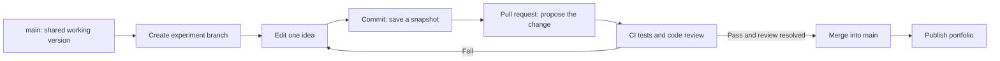
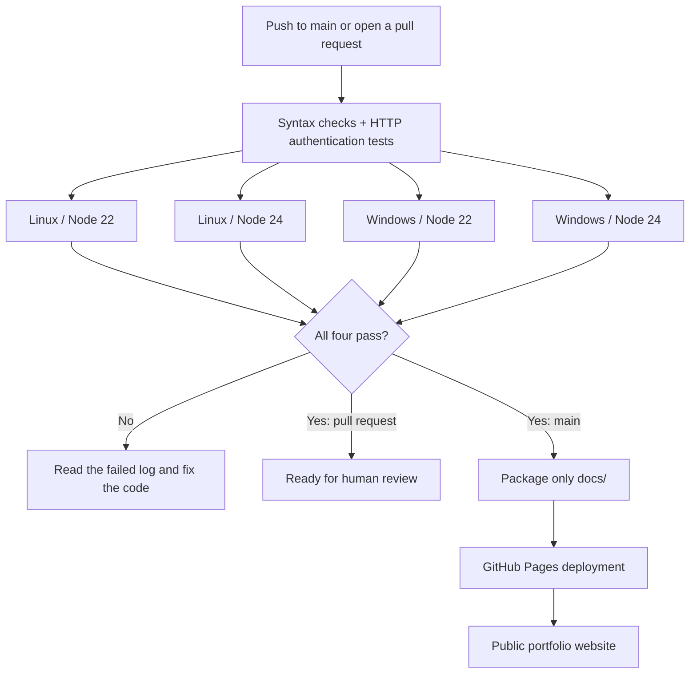
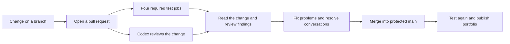
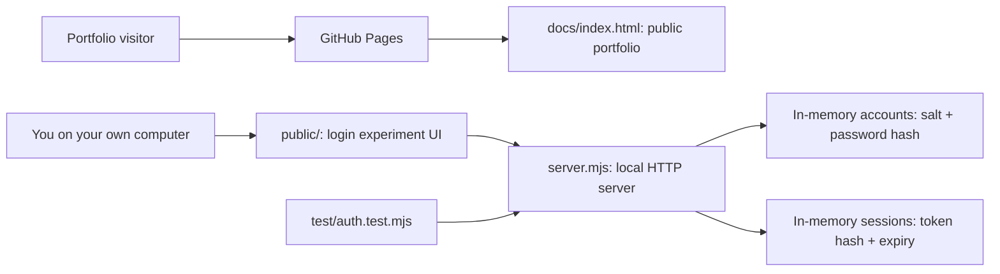
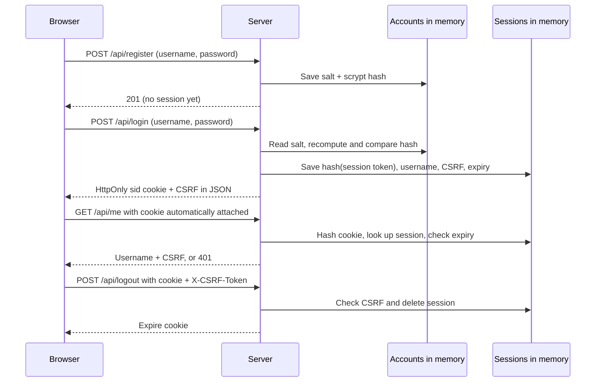
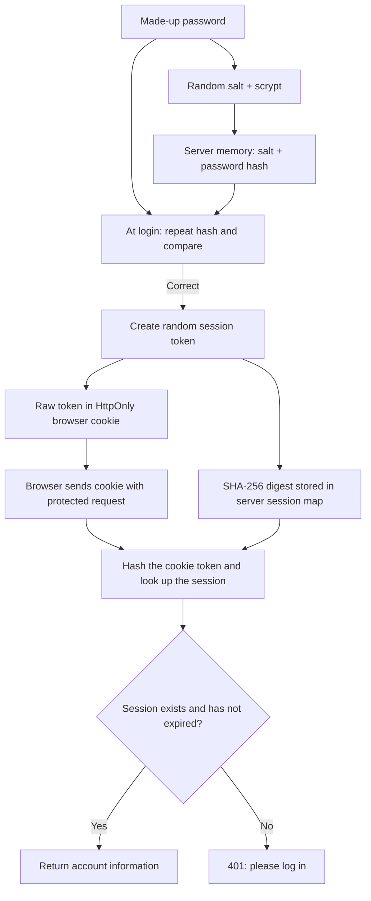
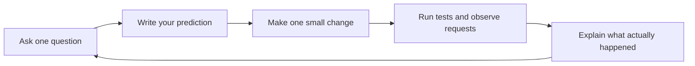

# Stash learning playground

[](https://github.com/mamditis58/stash/actions/workflows/ci-pages.yml)

**[Visit my public portfolio](https://mamditis58.github.io/stash/)** · [Browse automated checks](https://github.com/mamditis58/stash/actions)

Welcome! This repository is my space to learn by building, testing ideas, and explaining what I discover. It contains a public portfolio in `docs/index.html` and a local authentication experiment. Planned experiments are labeled as plans, not completed projects.

## GitHub from the beginning

- **Repository (repo):** the project's files and the history of changes to them.
- **Commit:** a saved snapshot with a short message explaining what changed. You can inspect old snapshots in History.
- **Branch:** a separate line of work. Try ideas on `experiment/your-idea` so you can review them before changing `main`.
- **Pull request (PR):** a proposal to merge a branch into `main`. The Files changed tab shows the difference; automated checks test the proposal.
- **CI:** continuous integration. GitHub runs the checks for you on its own computers whenever you push to `main` or open/update a PR targeting it.
- **GitHub Actions:** the automation service that runs CI. Instructions live in `.github/workflows/ci-pages.yml`.
- **GitHub Pages:** hosting for the static public portfolio. It serves the files in `docs/`; it cannot run the Node authentication server.

## Make your first change in the browser



1. Open `docs/index.html` in the Code tab. Click the pencil to edit it.
2. Change one sentence about what you are learning. Keep planned projects labeled as planned.
3. Click **Commit changes**, write a clear message, and choose **Create a new branch for this commit and start a pull request**.
4. Open the PR and inspect **Files changed**. Wait for the checks to finish.
5. If a check is red, click it, read the failed step's log, and fix the cause. If the checks are green and the change looks right, merge the PR.
6. After the change reaches `main`, the same workflow tests it and republishes the portfolio. A successful PR check does not itself publish a preview.

## How CI and publishing work



The workflow tests JavaScript syntax and authentication behavior on Node 22 and 24, on both Linux and Windows. This checks four combinations. No package installation is needed because this project has no external dependencies.

Only after all tests pass on `main` does GitHub package `docs/` and deploy the portfolio. PRs run tests without publishing. You can rerun it from **Actions → CI and portfolio → Run workflow**. The green badge above reflects the latest workflow status; it does not mean every possible bug is ruled out.

The test jobs can only read repository contents. The deployment job gets the Pages and short-lived identity permissions required to publish. You do not need to create a personal access token or add a secret. This CI does not block manual merges by itself; branch protection is a separate setting.

To enable hosting, use **Settings → Pages → Build and deployment → Source: GitHub Actions**. The public URL is `https://mamditis58.github.io/stash/`. Edit only `docs/index.html` for portfolio changes; `public/` belongs to the local login experiment.

Official references: [GitHub flow](https://docs.github.com/en/get-started/using-github/github-flow), [GitHub Actions](https://docs.github.com/en/actions/get-started/understand-github-actions), and [Pages workflows](https://docs.github.com/en/pages/getting-started-with-github-pages/using-custom-workflows-with-github-pages).

`mamditis58/stash` was empty when inspected on October 5, 2026. This is a new educational starter, not an explanation of pre-existing code. It uses Node's built-in HTTP and crypto modules; no packages, database, API keys, GitHub token, or OAuth setup are required.

## Protected changes and Codex review

`main` is the shared version. Its branch protection rule requires a pull request and four passing test jobs. The branch must be up to date with `main`. Review conversations must be resolved before merge. These rules also apply to the repository owner. Force pushes and branch deletion are blocked.

No approval count is required because this is a solo learning repository. You must still read the change and any review findings before you merge it.



The ChatGPT Codex Connector is installed. Automatic review was enabled in Codex settings. You can also post `@codex review` on a pull request to request a review. Codex uses the code review rules in `AGENTS.md`. Its review helps find problems, but it does not replace your own checks. A Codex review is not a required status check in this branch rule.

`AGENTS.md` also requires STE-informed plain language. Use short sentences and common words. Define a technical term when it is first needed. Keep code names and technical facts correct. This rule covers code comments, docs, reviews, and messages.

See the [official Codex GitHub guide](https://learn.chatgpt.com/docs/third-party/github) for review settings and commands.

## Run on Windows

Requires Node.js 22 or newer (verified with 22.18.0).

```powershell
npm.cmd test
npm.cmd start
```

Open http://127.0.0.1:3000. Register a made-up username and a password of at least 12 characters, enter the password again, then log in. Click **Who am I?**, then **Log out**. Open browser DevTools → Network and Application → Cookies to follow the process. `npm.cmd run dev` restarts on source edits and resets accounts and sessions. Stop with Ctrl+C. Set `$env:PORT = '3001'` before starting to use another port.

## Components and request flow



| Component | Code | Responsibility |
| --- | --- | --- |
| Browser form | `public/index.html` | Collect temporary credentials and expose experiment buttons |
| Browser request client | `public/app.js` | Send JSON, display responses, hold CSRF token in memory |
| HTTP server | `server.mjs`, `createApp` | Route requests and enforce origin, session and CSRF checks |
| Account store | `users` Map | Hold username, random salt and scrypt password hash |
| Session store | `sessions` Map | Map SHA-256 of session token to username, CSRF token and expiry |
| Integration test | `test/auth.test.mjs` | Exercise real HTTP requests against an isolated server |



### Credentials and tokens



- **Password:** transmitted in the registration/login JSON body. The browser clears the password field after submitting. The server derives a 64-byte scrypt hash with a random 16-byte salt and stores the salt and hash in memory. It compares hashes with `timingSafeEqual`; it never stores the plaintext password or logs request bodies. Password hashing is one-way, not encryption. Local HTTP traffic is not encrypted; use only invented credentials.
- **Session token (`sid`):** a random 32-byte opaque value. The browser stores the raw value in an `HttpOnly`, `SameSite=Strict` cookie. JavaScript cannot read that cookie; the browser attaches it to same-origin requests. The server stores only its SHA-256 digest. Possession of the raw token grants access, so never paste it into commits or screenshots.
- **Session expiry:** fixed 15 minutes, checked on the server on every protected request. Login replaces the session supplied by that browser. Logout deletes it immediately and expires the cookie. Restarting clears every account and session.
- **CSRF token:** a separate random value stored in the session and returned to the frontend. It is held in JavaScript memory and sent in `X-CSRF-Token` on logout. Reloading retrieves it through `/api/me`. It protects state-changing authenticated requests from cross-site request forgery; it is not a login credential and does not prevent XSS.
- **GitHub credentials:** unrelated to application login. This app needs none. GitHub authentication is only needed to publish code; never put a personal access token in these source files or a Git remote URL.
- **No JWT or OAuth:** there is no bearer JWT, refresh token, external identity provider, or role system. These are future experiments.

### Boundaries of this exercise

The server binds to `127.0.0.1`. Accounts are deliberately disposable. This is not ready for deployment: it lacks rate limiting, persistent storage, account recovery, email verification, MFA, role authorization and resource limits. Cookies omit `Secure` because the exercise uses local HTTP; a deployed version needs HTTPS and secure cookies. Origin checks reject browser POSTs from other sites; JSON-only registration/login and a CSRF check on logout add protection. Do not expose this server on the internet or use real credentials.

## Experiments



1. **Read before changing:** inspect the Network tab for `/api/register`, `/api/login`, `/api/me` and `/api/logout`. Predict each status before clicking.
2. **Expiry:** change the default `sessionTtlMs` in `createApp` to 10,000. Log in, wait ten seconds, and request `/api/me`. Expect 401.
3. **CSRF:** inspect the test that omits `X-CSRF-Token`. Expect 403 even with a valid cookie.
4. **Session rotation:** the test logs in again with an existing cookie and verifies that the old cookie no longer works.
5. **Persistence:** add a SQLite account store, preserving the random salts and hashes. Keep sessions disposable initially. Add a restart test before calling it complete.
6. **Authorization:** add a role to the account and an `/api/admin` endpoint. Authentication answers “who are you?”; authorization answers “may you do this?” Return 403 for a logged-in non-admin.
7. **External identity:** build OAuth on a separate branch using a dedicated test provider application. Study redirect URI validation, state and PKCE before implementing it.

Before each experiment, run tests, create a branch such as `experiment/session-expiry`, make one change, rerun tests, and record your prediction and result. `.gitignore` excludes `.env`, local data and logs. Keep credentials out of tracked files.

## Work locally later

Download the latest project using **Code → Download ZIP**, extract it, and open a terminal in the extracted folder. Node.js 22 or newer is needed to run the local server. A ZIP is enough to run it but does not contain Git history. For a full clone after Git is working:

```powershell
git clone https://github.com/mamditis58/stash.git
cd stash
npm test
npm start
git switch -c experiment/session-expiry
```

Stop the server with Ctrl+C before returning to Git commands. Authenticate through your normal Git credential manager when pushing your own changes. If Git reports that `remote-https` is missing, repair Git for Windows or keep using GitHub's browser editor. The playground runs locally without a GitHub credential.
